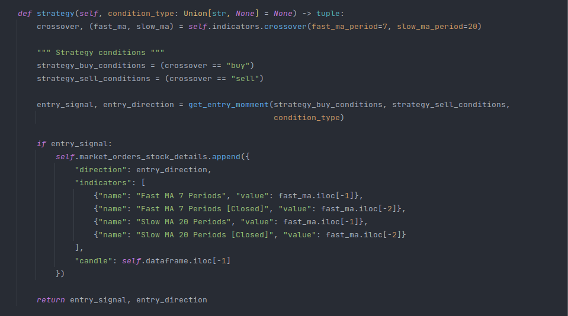

# Python Trading



> Crossover strategy image example

#### This project aims to gather negotiation strategies aimed at the financial market, so that people can take as an example the strategies provided in the project.

## 💻 Prerequisites

* Language Version `Python >= 3.8`.
* OS `Linux / Windows / Mac`. 

## 🚀 Install

1. First, clone project repository:
```bash
$ git clone https://github.com/preduus/python-trading.git
```

2. Creating virtual environment
```bash
$ virtualenv -p /usr/bin/python3.8 venv && source venv/bin/activate
OR
$ python3 -m venv $(pwd)/venv && source venv/bin/activate
```

3. Install project requirements:
```bash
$ pip install -r requirements.txt
```

## Testing
```bash
$ pytest -s
=========================================================================================================== test session starts ===========================================================================================================
platform linux -- Python 3.8.10, pytest-6.2.5, py-1.11.0, pluggy-1.0.0
rootdir: ~/python-trading
collected 9 items                                                                                                                                                                                                                         

tests/test_chinese_example.py ...
tests/test_crossover_example.py ...
tests/test_rsi_example.py ...

============================================================================================================ 9 passed in 0.43s ============================================================================================================
```

## ☕ Usage

To see trading strategies working, run:
```bash
$ python examples.py
```
In the example.py file, the algorithm simulates real price movements. The asset used to exemplify was the EURUSD.


## 📫 Contribute to project
The project needs a lot of input for us to add more trading strategies, if you feel like helping or have a promising strategy idea, please open an [issue](/../../issues) and help us.

1. Fork the project.
2. Create a branch: `git checkout -b feature/<branch_name>`.
3. Commit your code changes: `git commit -m '<message>'`
4. Push to your work branch: `git push origin feature/<branch_name>`
5. Open a pull request.

Alternatively, see on GitHub docs [How to create a pull request](https://help.github.com/en/github/collaborating-with-issues-and-pull-requests/creating-a-pull-request).

<!--
## 🤝 Contributors

<table>
  <tr>
    <td align="center">
      <a href="#">
        <br>
        <sub>
          <b>Pedro Rodrigues</b>
        </sub>
      </a>
    </td>
  </tr>
</table> 
-->

## 📝 Licença

Distributed under the BSD 3 License. See LICENSE for more information.

[⬆ Voltar ao topo](#python-trading)<br>